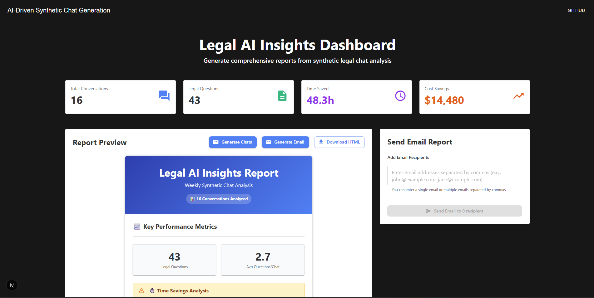
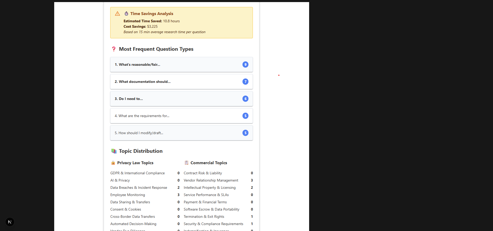
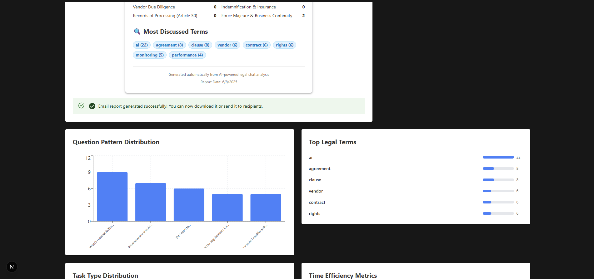
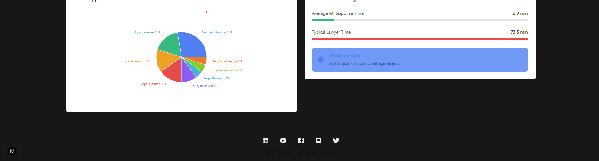

# 🤖 AI-Driven Synthetic Chat

A Next.js application that generates synthetic legal chat conversations using AI and provides comprehensive analytics through an interactive dashboard. The app creates realistic interactions between in-house lawyers and legal AI, focusing on privacy law and commercial contracts. ⚖️✨

## ✨ Features

- Create realistic legal chat conversations using Anthropic's Claude API
- View comprehensive analytics and insights from generated chats
- Generate and send detailed HTML reports via email
- Analyze question patterns, legal topics, and conversation statistics
- Support for both privacy law and commercial contracts scenarios

## 🛠️ Tech Stack

- **Frontend**: Next.js 15, React 19, Material-UI, Recharts, TailwindCSS
- **Backend**: Next.js API routes, Node.js
- **AI Integration**: Anthropic Claude API
- **Data Management**: TanStack Query, Zod validation
- **Styling**: Material-UI with custom theming, TailwindCSS
- **Language**: TypeScript, ESLint, Prettier

## 📋 Prerequisites

- Node.js 20+
- pnpm package manager (v10.11.0)
- Anthropic API key

## 🚀 Installation

1. Clone the repository

   ```bash
   git clone <repository-url>
   cd ai-driven-synthetic-chat
   ```

2. Install dependencies

   ```bash
   pnpm install
   ```

3. Environment Setup - Create a `.env.local` file in the root directory:

   ```env
   ANTHROPIC_API_KEY=your_anthropic_api_key_here
   ```

4. Start the development server

   ```bash
   pnpm dev
   ```

   The application will be available at `http://localhost:3000`

## 💻 Usage

### 🤖 Generating Synthetic Chats

1. Click "Generate Chats" button in the main dashboard
2. Run the chat generation script directly via command line:
   ```bash
   pnpm generate-chat
   ```

### 📈 Generating Reports

1. Click "Generate Email" in the dashboard to create comprehensive analytics
2. Run the report generation script directly via command line:
   ```bash
   pnpm generate-report
   ```
3. View real-time statistics including:
   - Total conversations and legal questions
   - Time and cost savings metrics
   - Question pattern analysis
   - Legal topic categorization

### 📮 Email Reports

1. Generate an email report from the dashboard
2. Add recipient email addresses
3. Send formatted HTML reports with complete analytics

## 📁 Project Structure

```
src/
├── api/
│   ├── analysis/          # Report generation and data analysis
│   ├── chatGenerator/     # Synthetic chat creation logic
│   └── types/            # TypeScript type definitions
├── components/           # React components
├── data/
│   └── hooks/           # TanStack Query hooks
├── pages/               # Next.js pages directory
│   ├── api/             # API route handlers
│   ├── _app.tsx         # App configuration
│   ├── _document.tsx    # Document structure
│   └── index.tsx        # Home page
├── resources/           # Static resources and example data
└── styles/             # Theme and styling configuration
```

## 🔧 Key Components

### 🤖 Chat Generation

- Manages the entire chat generation pipeline
- Retrieves source data from example URLs
- Creates synthetic conversations using AI prompts
- Processes and validates generated content

### 📊 Analytics & Reporting

- Analyzes chat data and creates comprehensive reports
- Identifies common question patterns and legal topics
- Computes conversation metrics and insights

### 🖥️ Dashboard Features

- Key metrics display (conversations, questions, savings)
- Live preview of generated reports
- Visual representation of question patterns and legal terms
- Recipient management and sending functionality

## 🔌 API Endpoints

### 📡 `/api/generate-chats` (POST)

Generates synthetic chat conversations

- Uses example chat URLs as training data
- Creates both privacy and commercial law scenarios
- Returns generated chat data

### 📋 `/api/generate-report` (POST)

Generates comprehensive analytics report

- Analyzes existing chat data
- Calculates statistics and patterns
- Returns structured report data

## 🛠️ Scripts

- `pnpm dev` - Start development server with Turbopack
- `pnpm build` - Build production application
- `pnpm start` - Start production server
- `pnpm lint` - Run ESLint
- `pnpm lint:fix` - Run ESLint with auto-fix
- `pnpm format` - Format code with Prettier
- `pnpm format:fix` - Format code with Prettier (write mode)
- `pnpm typecheck` - Run TypeScript type checking
- `pnpm generate-chat` - Generate synthetic chats via CLI
- `pnpm generate-report` - Generate analytics report via CLI

## ⚙️ Configuration

### 🌍 Environment Variables

- `ANTHROPIC_API_KEY` - Required for AI chat generation

### 📦 Package Manager

This project uses pnpm v10.11.0. Ensure you have pnpm installed:

```bash
npm install -g pnpm@10.11.0
```

## ⚖️ Legal Domains Supported

### 🔒 Privacy Law

- GDPR & International Compliance
- AI & Privacy regulations
- Data Breaches & Incident Response
- Employee Monitoring policies
- Data Sharing & Transfers
- Consent & Cookies management

### 📝 Commercial Contracts

- Contract Risk & Liability assessment
- Vendor Relationship Management
- Intellectual Property & Licensing
- Service Performance & SLAs
- Payment & Financial Terms

## 👨‍💻 Development

### 🏆 Code Quality

- ESLint configuration with Prettier integration
- TypeScript strict mode enabled
- Automated formatting on save
- TailwindCSS for utility-first styling

### 🏗️ Architecture

- Modular component structure
- Custom hooks for data management
- Type-safe API communications
- Responsive Material-UI design system with TailwindCSS integration

### 🔧 Key Dependencies

- **@anthropic-ai/sdk** - Claude API integration
- **@tanstack/react-query** - Server state management
- **@mui/material** - UI component library
- **recharts** - Data visualization
- **react-hook-form** - Form management
- **zod** - Schema validation

## 🤝 Contributing

1. Fork the repository
2. Create a feature branch
3. Make your changes
4. Run tests and linting:
   ```bash
   pnpm typecheck
   pnpm lint
   pnpm format
   ```
5. Submit a pull request

## 🆘 Support

For questions and support, please refer to the project documentation or contact the project owner.






---

# Legal AI Analytics Platform Development

## What I did:

### Website and User Interface Development
- **Built a comprehensive NextJS website** for displaying interactive report data previews with real-time insights
- **Implemented mock data integration** initially to demonstrate the final report structure and user experience
- **Designed an intuitive email distribution interface** allowing users to send reports directly from the preview page
- **Integrated TanStack Query** for robust API state management, handling report generation, synthetic chat creation, and email delivery with proper loading states and error handling
- **Created a responsive, professional interface** that showcases legal AI analytics in an accessible format for both technical and non-technical stakeholders

### Advanced Report Analysis Engine
- **Developed a sophisticated question extraction and classification system** that identifies user inquiry patterns using natural language processing techniques
- **Implemented multi-layered analysis** including decision-making pattern recognition (identifying "should I do this or that" type questions) and legal domain categorization using curated keyword libraries for privacy law and commercial contracts
- **Built topic categorization algorithms** that analyze chat titles and content to automatically classify conversations into specific legal areas (GDPR compliance, data breaches, MSAs, liability clauses, etc.)
- **Created a task identification and time estimation system** that matches user queries to traditional legal research tasks, assigns complexity scores based on keyword density and question length, then calculates time savings by comparing AI response times to conventional lawyer research duration
- **Integrated cost analysis** using industry-standard lawyer billing rates ($300/hour) to quantify financial impact and ROI of AI implementation
- **Developed comprehensive statistical analysis** including conversation metrics, message patterns, user engagement levels, and identification of the most complex discussions

### Intelligent Chat Generation System
- **Engineered a sophisticated Anthropic API integration** with optimized token management (20,000 token limit) to handle complex synthetic chat generation efficiently
- **Evolved from unreliable single-request generation** to a robust configurable batch processing system that significantly improves JSON completion rates and data quality
- **Implemented intelligent batch configuration** including dynamic sizing, retry logic with exponential backoff, inter-batch delays for API stability, and optional debug output saving for troubleshooting
- **Built a two-tier prompting system**: comprehensive initial prompts with real-world examples from GC AI, followed by compressed continuation prompts to optimize token usage while maintaining context
- **Created automated data fetching and preprocessing pipeline** that extracts and formats example conversations from live legal AI platforms to ensure synthetic data authenticity
- **Developed sophisticated prompt caching mechanisms** to eliminate redundant API calls and reduce generation costs while maintaining data quality
- **Added concurrency protection** to prevent overlapping generation requests that could compromise data integrity

### Professional Email Distribution Infrastructure
- **Integrated Resend email service** with custom React Email components for pixel-perfect, professional report delivery
- **Built comprehensive email validation**, batch processing, and individual delivery tracking with detailed success/failure reporting
- **Created responsive email templates** that maintain formatting integrity across all major email clients and devices

---

## Future Improvements:

### Performance and Scalability Optimizations
- **Implement Redis caching layer** for report data to eliminate redundant processing and enable sub-second report delivery for frequently requested insights
- **Migrate to Express.js backend architecture** with proper middleware stack for improved performance, better error handling, and enhanced API organization
- **Add PostgreSQL database with Drizzle ORM** for persistent storage of synthetic chats, enabling historical trend analysis and continuous improvement of topic categorization algorithms
- **Implement Bull Queue background job processing** to handle computationally intensive report generation asynchronously, reducing user wait times from 8+ minutes to near-instantaneous response
- **Create incremental data processing capabilities** that can analyze new conversations without reprocessing entire datasets

### Advanced AI and Machine Learning Integration
- **Integrate sophisticated natural language processing** beyond keyword matching to understand legal question complexity, urgency, and domain specificity with greater accuracy
- **Implement sentiment analysis** to gauge lawyer confidence levels, satisfaction with AI responses, and identify areas where AI assistance is most/least effective
- **Develop rolling context window management** for chat generation to maintain conversation quality and coherence even when scaling to 50+ synthetic conversations per batch
- **Add machine learning models** for automatic discovery of emerging legal topics and question patterns that aren't captured by current keyword-based classification
- **Implement intelligent prompt optimization** that learns from successful generation patterns to improve synthetic data quality over time

### Enhanced User Experience and Functionality
- **Build interactive chat viewing modal** with carousel navigation for quick quality assessment of generated conversations
- **Add role-based definitions and context** for privacy and commercial contract lawyers to provide richer LLM context and improve synthetic data authenticity
- **Create customizable dashboard widgets** allowing users to focus on specific legal domains or metrics relevant to their practice area
- **Implement real-time generation progress tracking** with WebSocket connections to provide transparent feedback during long-running operations
- **Add export functionality** for multiple formats (PDF, Excel, PowerPoint) to support diverse stakeholder reporting needs

### Enterprise Security and Integration
- **Build comprehensive API endpoint architecture** with OAuth2 authentication, role-based access control, and rate limiting for enterprise deployment
- **Implement audit logging and compliance tracking** for all data processing activities to meet legal industry regulatory requirements
- **Add webhook integrations** for popular legal platforms (Clio, LexisNexis, Westlaw) to enable seamless workflow integration
- **Create data encryption standards** for all stored conversations and reports, with proper key management for handling confidential legal communications
- **Develop multi-tenant architecture** to support law firms and legal departments with isolated data and customized analytics

### Quality Assurance and Testing Infrastructure
- **Implement comprehensive unit testing suite** using Jest for all utility functions and modular components with >90% code coverage
- **Add Mock Service Worker integration** for reliable API testing without external dependencies
- **Create end-to-end testing pipeline** using Playwright or Cypress to validate complete user workflows from chat generation through report delivery
- **Build automated data quality validation** to detect and flag anomalies in synthetic chat generation before they impact analysis results
- **Implement A/B testing framework** for different analysis algorithms to continuously optimize accuracy and relevance of insights

### Advanced Analytics and Reporting
- **Develop predictive modeling** to forecast optimal AI implementation strategies based on current usage patterns and firm characteristics
- **Create comparative benchmarking features** that allow firms to measure their AI adoption success against industry standards and peer organizations
- **Add time-series analysis** to track improvement trends in lawyer-AI interaction efficiency over extended periods
- **Implement anomaly detection** to identify unusual usage patterns that might indicate training needs or system optimization opportunities
- **Build executive summary generation** that automatically creates board-ready reports highlighting key ROI metrics and strategic recommendations

## Batching vs. Cleaning/Repair Approach Comparison

### Batching (Multiple API Calls)

```typescript
// Generate 6 chats as 3 batches of 2
const allChats = [];
for (let i = 0; i < 3; i++) {
  const batch = await generateChats(2); // Smaller, reliable requests
  allChats.push(...batch);
}
```

### Clean & Repair (Single API Call + Recovery)

```typescript
// Generate all 6 chats in one call, then repair truncated response
const response = await generateChats(6); // Might get truncated
const cleanedChats = cleanAndRepairResponse(response); // Salvage what we can
```

## Detailed Comparison of Batching Anthropic calls vs Cleaning Anthropic calls

### **Reliability**

| Aspect         | Batching                              | Cleaning                                   |
| -------------- | ------------------------------------- | ------------------------------------------ |
| Success Rate   | **99%** - Small requests rarely fail  | **70-80%** - Depends on truncation point   |
| Predictability | **High** - Consistent small responses | **Medium** - Variable truncation locations |
| Worst Case     | Missing 1 batch (still get 4/6 chats) | Could lose 50%+ of content                 |

### **Performance**

| Metric           | Batching                              | Cleaning                             |
| ---------------- | ------------------------------------- | ------------------------------------ |
| Total Time       | **20-25 seconds** (3 × 7s + overhead) | **15-20 seconds** (1 × 15s + repair) |
| API Calls        | 5 calls                               | 1 call                               |
| Network Overhead | ~1-2 seconds extra                    | None                                 |
| Processing Time  | Minimal                               | ~1-2 seconds for repair              |

### **Resource Usage**

| Resource    | Batching         | Cleaning                    |
| ----------- | ---------------- | --------------------------- |
| API Quota   | **5× requests**  | **1× request**              |
| Tokens Used | ~Same total      | ~Same total                 |
| Memory      | Lower peak usage | Higher peak usage           |
| CPU         | Minimal          | More intensive repair logic |

### **Development Complexity**

| Factor          | Batching                      | Cleaning                                 |
| --------------- | ----------------------------- | ---------------------------------------- |
| Code Complexity | **Simple** - Basic loop       | **Complex** - JSON parsing, repair logic |
| Error Handling  | **Easy** - Per-batch failures | **Hard** - Many edge cases               |
| Testing         | **Straightforward**           | **Complex** - Many truncation scenarios  |
| Maintenance     | **Low** - Stable pattern      | **Medium** - JSON repair can break       |

### **Data Quality**

| Quality Aspect | Batching                          | Cleaning                                        |
| -------------- | --------------------------------- | ----------------------------------------------- |
| Completeness   | **100%** of successful chats      | **60-90%** depending on truncation              |
| Consistency    | **High** - All chats fully formed | **Variable** - Some chats may be incomplete     |
| Usability      | **Immediate** - All data ready    | **Requires validation** - Need to check repairs |
